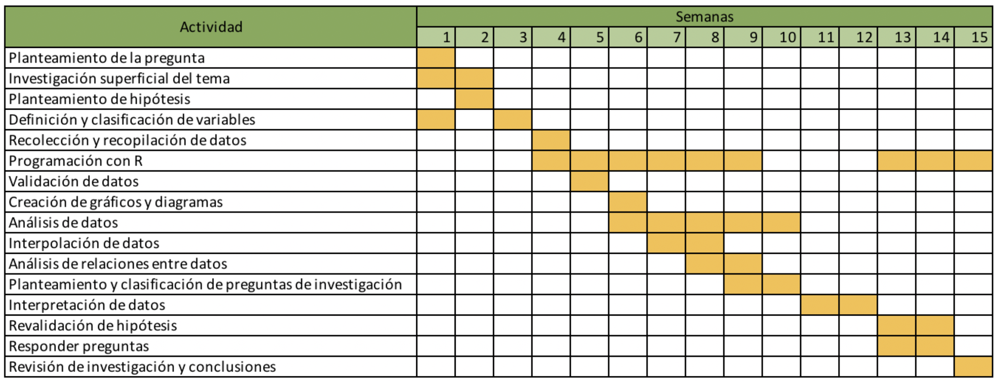

```{r message=FALSE, warning=FALSE, include=FALSE}
reqpackages <- c("prettydoc", "plyr", "dplyr","ggplot2", "lubridate")
newpackages <- reqpackages[!(reqpackages %in% installed.packages()[,"Package"])]
if(length(newpackages)) install.packages(pkgs=newpackages, repos = "http://cran.us.r-project.org")
```

##Justificación del tema
<div style="text-align: justify">
Los incendios en Estados Unidos son muy comunes y a menudo conducen a muertes. [En el 2016, 3390 personas fallecieron a causa de ellos](https://www.statista.com/statistics/376703/us-civilian-fire-deaths/). Algunos de los factores que contribuyen a la dispersión del fuego son la [cantidad de hogares prefabricados con madera, los numerosos bosques que tiene cada estado, el clima seco y las temperaturas altas](https://www.statista.com/statistics/376703/us-civilian-fire-deaths/). </br>
Se han realizado numerosos estudios anuales sobre las causas de incendios, de los cuales [la mayoría se encuentra centrada únicamente en incendios forestales](https://www.iii.org/fact-statistic/facts-statistics-wildfires). En la actualidad, no hay un estudio que describa todos los tipos de causas de incendios en EEUU a través de un amplio rango de tiempo. La mayor fuente de información sobre incendios, el USFA (Administración de Incendios de Estados Unidos), [provee de datos organizados en gráficos](https://www.usfa.fema.gov/data/statistics/#tab-3) sobre la cantidad de incendios, víctimas y la pérdida de propiedad, así como sus tendencias. Incluso brinda datos tabulados en informes publicados [aquí](https://www.usfa.fema.gov/data/statistics/order_download_data.html#download). Sin embargo, los datos se agrupan en tipo de propiedad y se enfocan en la pérdida de propiedad. Lo más cercano a una agrupación por causas se encuentra evaluado tan solo en dos años separados ( [2011](https://www.usfa.fema.gov/downloads/xls/statistics/us_fire_loss_data_sets_2000-2011.xlsx) y [2015](https://www.usfa.fema.gov/downloads/xls/statistics/us_fire_loss_data_sets_2006-2015.xlsx)) y las razones detrás de los datos no han sido analizadas. Como un segundo ejemplo, tenemos también al NFPA (Asociación Nacional de Protección contra Incendios), que publica distintos reportes sobre incendios. De estos podemos resaltar uno de los más completos, realizado en el 2017, sobre incendios en casas y donde podemos observar que únicamente se encuentran las causas principales en el periodo conjunto del 2011 al 2015 [pg. 8](https://www.nfpa.org/-/media/Files/News-and-Research/Fire-statistics-and-reports/Building-and-life-safety/osHomes.pdf).
Nuestra propuesta es analizar los incendios desde el 2010 hasta el 2014, estudiar sus causas e intentar averiguar por qué algunas causas prevalecen y otras dejan de ser comunes.

**Público objetivo:** Entidades relacionadas a incendios
</div>

##Objetivos
1. Usar la estadística para comprender las causas de incendios en EEUU en diferentes estados.
2. Comparar grandes cantidades de datos a lo largo de la historia.
3. Brindar información útil para la Administración de Incendios de Estados Unidos (USFA) sobre sus incendios con esperanza de brindar un mejor entendimiento y, de esa manera, prevenir accidentes.
4. Tener un informe amigable y conciso para concientizar a las diferentes entidades interesadas.


##Variables
* Cualitativas:
    + Nominal: State,  Fire Dept. ID, Cause Code, Incident Date 
    + Ordinal: General Cause Category,  Primary Cause Category
* Cuantitativas:
    + Discretas: Exposure No., deaths
    + Continua: Tiempo, alarm time, arrival time

##Unidades muestrales
* Población objetivo: Incendios reportados por el National Fire Incident Reporting System en el 2010, 2012 y 2014.
* Unidad muestral: Incendio registrado en el National Fire Incident Reporting System.
* Tipo de muestreo: No probabilístico, basado en la disponibilidad del sujeto (incendios). Los datos que tenemos son los incendios que la National Fire Incident Reporting System (NFIRS) de los Estados Unidos pudo registrar. Si bien la participación no es obligatoria para algunos estados, los set de data referenciados en este proyecto sí incluyen todos los 50 estados con más de dos tercios de participación de los departamentos de bomberos a nivel nacional (pg.4). La Administración de Incendios de Estados Unidos (USFA) considera que el NFIRS contiene la cantidad suficiente de información que se necesita para hacer estimados razonables de las varias facetas de un problema de fuego. [(Fuente, página 4)](https://www.usfa.fema.gov/downloads/pdf/publications/nfirs_data_quality_report.pdf).


##Planificación
<div style="text-align: justify">
Las primeras semanas nos centraremos en el planteamiento inicial, es decir, la construcción de la pregunta a la que orientaremos nuestro proyecto, la hipótesis y reconocimiento de variables. Lo anterior se realizará con el conocimiento obtenido de una breve investigación previa, para evitar que la base de nuestro proyecto se encuentre completamente desviada del tema. En la siguiente etapa se trabajará en el procesamiento: la recolección, validación y creación de gráficos. La programación con R y R Markdown será fundamental por su capacidad en la manipulación de datos y edición del documento. Lo siguiente será interpretar los datos y plantearse preguntas que estos levanten. A partir de ello podremos reconocer tendencias y relaciones entre datos. Por último, se realizará una revisión de la hipótesis y responderán las preguntas.
</div>



##Fuente de datos
<div style="text-align: justify">
Los datos serán recolectados del repositorio de datos [Enigma Public](https://public.enigma.com/browse/77c6597b-eb82-4a2f-9d2e-5aedea1cae1d), específicamente de la sección National Fire Incident Reporting System - Causes, en donde se pueden encontrar tablas para cada año desde 2010 hasta 2014. Cada una de las tablas contiene información sobre los incendios ocurridos en ese año. Las columnas principales son:
</div>

* State: El estado donde ocurrió el incendio
* Fire Dept. ID: El identificador del departamento de bomberos que atendió el incendio
* Incident Date: La fecha del incendio
* Incident No.: El número del incidente
* Exposure No.: El número de la exposición (un incendio que resulta de otro incendio)
* Primary Cause Category
* Cause Code
* General Cause Category


<div style="text-align: justify">

Cada causa tiene un Primary Cause Category y un Cause Code, que son números enteros. El significado de cada uno de estos códigos puede ser extraído de la [documentación](https://www.usfa.fema.gov/data/nfirs/support/documentation.html) de la web del National Fire Incident Reporting System en la sección **Structure Fire Cause Matrix**

Significados de cada Cause Code encontrado en la base de datos:
<ol>
<li>Intentional</li>
<li>Playing with Heat Source</li>
<li>Smoking</li>
<li>Heating</li>
<li>Cooking</li>
<li>Electrical Malfunction</li>
<li>Appliances</li>
<li>Open Flame</li>
<li>Other Heat</li>
<li>Other Equipment</li>
<li>Natural</li>
<li>Exposure</li>
<li>Unknown</li>
<li>Equipment Misoperation / Failure</li>
<li>Other Unintentional / Careless</li>
<li>Investigation with Arson Module</li>
</ol>
</div>

##Preguntas de investigación

```{r echo=FALSE, message=FALSE, warning=FALSE}
formatdate <- function(filename, isGenIn=F){
  thefile <- read.csv(filename, stringsAsFactors = F)
  thefile <- thefile[rowSums(is.na(thefile)) == 0,]
  thefile$inc_date[nchar(thefile$inc_date)==7] <-paste("0", thefile$inc_date[nchar(thefile$inc_date)==7], sep="")
  thefile$inc_date <- as.Date(thefile$inc_date, format = "%m%d%Y") # as.Date used for dates

  if (isGenIn){
    thefile$alarm[nchar(thefile$alarm)==11] <-paste("0", thefile$alarm[nchar(thefile$alarm)==11],sep="")
    thefile$alarm <- as.POSIXct(thefile$alarm, format = "%m%d%Y%H%M") # as.POSIXct used for datetimes

    thefile$arrival[nchar(thefile$arrival)==11] <-paste("0", thefile$arrival[nchar(thefile$arrival)==11],sep="")
    thefile$arrival <- as.POSIXct(thefile$arrival, format = "%m%d%Y%H%M")

    thefile$lu_clear[nchar(thefile$lu_clear)==11] <-paste("0", thefile$lu_clear[nchar(thefile$lu_clear)==11],sep="")
    thefile$lu_clear <- as.POSIXct(thefile$lu_clear, format = "%m%d%Y%H%M")
  }
  return(thefile)
}

# Upload csv
c_2010 <- formatdate(file="data/Causes2010_cleaned.csv")
c_2012 <- formatdate(file="data/Causes2012_cleaned.csv")
c_2014 <- formatdate(file="data/Causes2014_cleaned.csv")
g_2010 <- formatdate(file="data/GenIn2010_cleaned.csv", T)
g_2012 <- formatdate(file="data/GenIn2012_cleaned.csv", T)
g_2014 <- formatdate(file="data/GenIn2014_cleaned.csv", T)
causes_2010 <- merge(c_2010, g_2010) #by= c("fdid", "exp_no", "inc_no"))
causes_2012 <- merge(c_2012, g_2012) #by= c("fdid", "exp_no", "inc_no"))
causes_2014 <- merge(c_2014, g_2014) #by= c("fdid", "exp_no", "inc_no"))

# Initialize causes
causes <- c()
causes[1] <- "Intentional"
causes[2] <- "Playing with Heat Source"
causes[3] <- "Smoking"
causes[4] <- "Heating"
causes[5] <- "Cooking"
causes[6] <- "Electrical Malfunction"
causes[7] <- "Appliances"
causes[8] <- "Open Flame"
causes[9] <- "Other Heat"
causes[10] <- "Other Equipment"
causes[11] <- "Natural"
causes[12] <- "Exposure"
causes[13] <- "Unknown"
causes[14] <- "Equipment Misoperation / Failure"
causes[15] <- "Other Unintentional / Careless"
causes[16] <- "Investigation with Arson Module"

```

###Preguntas descriptivas

####¿Cuál es el porcentaje de cada causa de incendios por año?
```{r echo=TRUE, message=FALSE, warning=FALSE}
library(ggplot2)
xrange <- c(1:16)
yrange_2010 <- c(prop.table(table(causes_2010$cause_code)))
yrange_2012 <- c(prop.table(table(causes_2012$cause_code)))
yrange_2014 <- c(prop.table(table(causes_2014$cause_code)))

df_2010 = data.frame(cause=xrange, perc=yrange_2010)
df_2012 = data.frame(cause=xrange, perc=yrange_2012)
df_2014 = data.frame(cause=xrange, perc=yrange_2014)

ggplot() + geom_point(data=df_2010, aes(x=cause, y=perc, group=1, colour="2010"))  +
  geom_point(data=df_2012, aes(x=cause, y=perc, group=1, colour="2012")) +
  geom_point(data=df_2014, aes(x=cause, y=perc, group=1, colour="2014")) +
  scale_x_continuous("Cause", labels = causes, breaks = xrange) +
  scale_y_continuous("Proportion of Cause") +
  scale_colour_manual("", breaks=c("2010","2012","2014"), values=c(rgb(1,0,0,0.4), rgb(0,1,0,0.4), rgb(0,0,1,0.4))) +
  theme(axis.text.x = element_text(angle=45, hjust=1))

```
<div>
Del gráfico anterior se concluye claramente que aproximadamente en el 40% de los incendios reportados la causa es desconocida, aunque esta tendencia disminuye a lo largo de los años. También se observa que las causas menos comunes son jugar con una fuente de calor e incendios causados a propósito (arsons). Por otro lado, a medida que avanza el tiempo, la causa de incendios por cocinar aumenta.
</div>

####¿Cuál es el mes con menos incendios por año?
```{r echo=FALSE, message=FALSE, warning=FALSE}
library(lubridate)
library(rmarkdown)

month_count2010 <- aggregate(cbind(count = month(causes_2010$inc_date)) ~ month(causes_2010$inc_date), data = causes_2010, FUN = function(x){NROW(x)})
colnames(month_count2010) <- c("month", "count")
min2010 <- min(month_count2010$count)
month_count2010 <- month_count2010[month_count2010$count %in% min2010,]
month_count2010$month <- month.name[as.integer(month_count2010$month)]
month_count2010['Year']=2010

month_count2012 <- aggregate(cbind(count = month(causes_2012$inc_date)) ~ month(causes_2012$inc_date), data = causes_2012, FUN = function(x){NROW(x)})
colnames(month_count2012) <- c("month", "count")
min2012 <- min(month_count2012$count)
month_count2012 <- month_count2012[month_count2012$count %in% min2012,]
month_count2012$month <- month.name[as.integer(month_count2012$month)]
month_count2012['Year']=2012

month_count2014 <- aggregate(cbind(count = month(causes_2014$inc_date)) ~ month(causes_2014$inc_date), data = causes_2014, FUN = function(x){NROW(x)})
colnames(month_count2014) <- c("month", "count")
min2014 <- min(month_count2014$count)
month_count2014 <- month_count2014[month_count2014$count %in% min2014,]
month_count2014$month <- month.name[as.integer(month_count2014$month)]
month_count2014['Year']=2014

paged_table(rbind(month_count2010, month_count2012, month_count2014))
```

####¿Cuál es la causa más común que ocasionan los incendios por estado en el año 2010?
```{r echo=FALSE, message=FALSE, warning=FALSE}

library(dplyr)

formatdate <- function(filename){
  thefile <- read.csv(filename)
  thefile$inc_date[nchar(thefile$inc_date)==7] <-paste("0", thefile$inc_date[nchar(thefile$inc_date)==7], sep="")
  return(thefile[rowSums(is.na(thefile)) == 0,])
}

x <- causes_2010%>%
  count(state, pcc, cause_code, gcc) %>%
  group_by(state) %>%
  filter(n == max(n))

x$cause_code <- causes[strtoi(x$cause_code)]
names(x)[3] <- "cause"

paged_table(data.frame(x[c(1,3)]))
```


###Preguntas exploratorias
#### ¿La población de las ciudades está relacionada con el índice de incendios por humo?
Se tomaron los 3 estados más poblados y los 3 estados menos poblados. Información disponible en https://es.wikipedia.org/wiki/Anexo:Estados_de_los_Estados_Unidos_por_poblaci%C3%B3n
```{r echo=FALSE, message=FALSE, warning=FALSE}
library(plyr)

#Causes 2010 --------------------
ct <- count(causes_2010, "state")

CAT <- ct[ct$state %in% "CA",]
CAT1 <- CAT$freq
TXT <- ct[ct$state %in% "TX",]
TXT1 <- TXT$freq
NYT <- ct[ct$state %in% "NY",]
NYT1 <- NYT$freq

VTT <- ct[ct$state %in% "VT",]
VTT1 <- VTT$freq
WAT <- ct[ct$state %in% "WA",]
WAT1 <- WAT$freq
WYT <- ct[ct$state %in% "WY",]
WYT1 <- WYT$freq


c_c9 <- causes_2010[causes_2010$cause_code==9,]
cc <- count(c_c9, "state")
CA <- cc[cc$state %in% "CA",]
CA1 <- CA$freq
TX <- cc[cc$state %in% "TX",]
TX1 <- TX$freq
NY <- cc[cc$state %in% "NY",]
NY1 <- NY$freq

VT <- cc[cc$state %in% "VT",]
VT1 <- VT$freq
WA <- cc[cc$state %in% "WA",]
WA1 <- WA$freq
WY <- cc[cc$state %in% "WY",]
WY1 <- WY$freq

vh <- c(CA1/CAT1,TX1/TXT1,NY1/NYT1,VT1/VTT1,WA1/WAT1,WY1/WYT1)

barplot(vh,names.arg=c("CA", "TX", "NY", "VT", "WA", "WY"), main = "2010", col=c("orange", "orange", "orange", "darkturquoise", "darkturquoise", "darkturquoise"))


#Causes 2012 --------------------
ct <- count(causes_2012, "state")

CAT <- ct[ct$state %in% "CA",]
CAT1 <- CAT$freq
TXT <- ct[ct$state %in% "TX",]
TXT1 <- TXT$freq
NYT <- ct[ct$state %in% "NY",]
NYT1 <- NYT$freq

VTT <- ct[ct$state %in% "VT",]
VTT1 <- VTT$freq
WAT <- ct[ct$state %in% "WA",]
WAT1 <- WAT$freq
WYT <- ct[ct$state %in% "WY",]
WYT1 <- WYT$freq


c_c9 <- causes_2012[causes_2012$cause_code==9,]
cc <- count(c_c9, "state")
CA <- cc[cc$state %in% "CA",]
CA1 <- CA$freq
TX <- cc[cc$state %in% "TX",]
TX1 <- TX$freq
NY <- cc[cc$state %in% "NY",]
NY1 <- NY$freq

VT <- cc[cc$state %in% "VT",]
VT1 <- VT$freq
WA <- cc[cc$state %in% "WA",]
WA1 <- WA$freq
WY <- cc[cc$state %in% "WY",]
WY1 <- WY$freq

vh <- c(CA1/CAT1,TX1/TXT1,NY1/NYT1,VT1/VTT1,WA1/WAT1,WY1/WYT1)

barplot(vh,names.arg=c("CA", "TX", "NY", "VT", "WA", "WY"), main = "2012", col=c("orange", "orange", "orange", "darkturquoise", "darkturquoise", "darkturquoise"))


#Causes 2014 --------------------
ct <- count(causes_2014, "state")

CAT <- ct[ct$state %in% "CA",]
CAT1 <- CAT$freq
TXT <- ct[ct$state %in% "TX",]
TXT1 <- TXT$freq
NYT <- ct[ct$state %in% "NY",]
NYT1 <- NYT$freq

VTT <- ct[ct$state %in% "VT",]
VTT1 <- VTT$freq
WAT <- ct[ct$state %in% "WA",]
WAT1 <- WAT$freq
WYT <- ct[ct$state %in% "WY",]
WYT1 <- WYT$freq


c_c9 <- causes_2014[causes_2014$cause_code==9,]
cc <- count(c_c9, "state")
CA <- cc[cc$state %in% "CA",]
CA1 <- CA$freq
TX <- cc[cc$state %in% "TX",]
TX1 <- TX$freq
NY <- cc[cc$state %in% "NY",]
NY1 <- NY$freq

VT <- cc[cc$state %in% "VT",]
VT1 <- VT$freq
WA <- cc[cc$state %in% "WA",]
WA1 <- WA$freq
WY <- cc[cc$state %in% "WY",]
WY1 <- WY$freq

vh <- c(CA1/CAT1,TX1/TXT1,NY1/NYT1,VT1/VTT1,WA1/WAT1,WY1/WYT1)

barplot(vh,names.arg=c("CA", "TX", "NY", "VT", "WA", "WY"), main = "2014", col=c("orange", "orange", "orange", "darkturquoise", "darkturquoise", "darkturquoise"))


```
<div>
**Conclusión**: Como podemos ver en las gráficas, no hay una relación visible ya que la diferencia entre los estados más habitados con los menos poblados es muy pequeña.
</div>

###Preguntas Inferenciales
####¿La mayoría de incendios ocurren en el día(6am-5pm)?

H0: La mayoría de incendios no ocurren de día
H1: La mayoría de incendios ocurren de día
```{r}
dia2010 <- causes_2010[hour(causes_2010$alarm)<17 & hour(causes_2010$alarm)>6,]
horas2010 <- hour(causes_2010$alarm)
mu2010 <- mean(horas2010)

dia2012 <- causes_2012[hour(causes_2012$alarm)<17 & hour(causes_2012$alarm)>6,]
horas2012 <- hour(causes_2012$alarm)
mu2012 <- mean(horas2012)

dia2014 <- causes_2014[hour(causes_2014$alarm)<17 & hour(causes_2014$alarm)>6,]
horas2014 <- hour(causes_2014$alarm)
mu2014 <- mean(horas2014)

mu_total <- (mu2010+mu2012+mu2014)/3
total_anos <- c(causes_2010,causes_2012,causes_2014)
total_horas <- hour(total_anos$alarm)
v <- c(0:23)

t.test(total_horas, mu=mu_total, alternative="greater", conf.level=0.80)
```

<div>
*Conclusión*: Se rechaza la hipótesis nula, ya que p-value vale 0.155 y nuestro alfa es 0.2. Podemos ver que p-value es menor.
</div>

###Preguntas Causales
####¿El factor más influyente de la provocaciones de incendios se debe a la actividad humana?

###Preguntas Predictivas
####¿Si se el número de estaciones de bomberos aumentan cuál sería el comportamiento del _exposure number_, y del número de incendios?
Para responder esto, es necesario hacer una regresión lineal entre el número de estaciones de bomberos y el comportamiento de _exposure number_. Recordar que _exposure number_ representa el número de incendios B, C, D,... ocasionados como daño colateral de un incendio original A. En el modelo lineal, _exposure number_ sería la variable respuesta y el número de estaciones de bomberos la variable predictora. Si la función linear resultara de pendiente negativa, se observaría que el aumento de estaciones de bomberos ocasiona una reducción de los incendios por daño colateral.

###Preguntas Mecanísticas
####¿Cómo afectan las estaciones a la provocación de incendios?


##Bibliografía adicional
* https://www.earth.com/news/wildfires-western-united-states/
* https://www.theguardian.com/world/2018/aug/12/wildfires-more-than-100-us-six-new-blazes-erupt
* https://www.iii.org/fact-statistic/facts-statistics-wildfires
* https://www.statista.com/statistics/376703/us-civilian-fire-deaths/